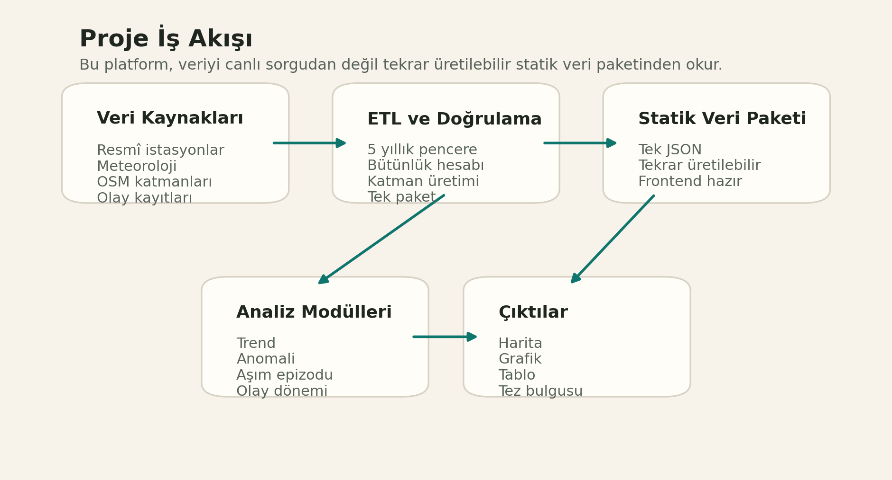
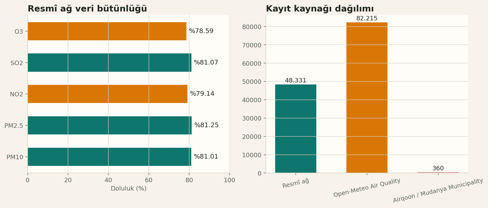
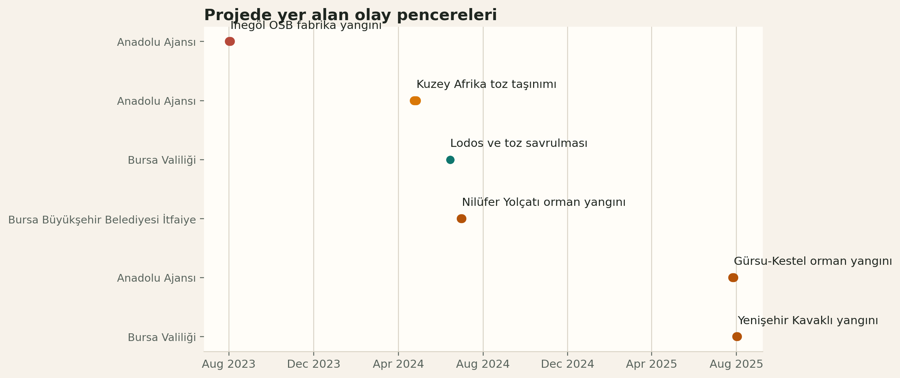

# Bursa Hava Kirliliği Proje Dokümanı

Bu doküman, Bursa odaklı hava kirliliği analiz platformunun ne yaptığını, nasıl okunması gerektiğini ve tez çalışmasında nasıl kullanılabileceğini kısa ve açık biçimde anlatır.

## 1. Proje Nedir?

Bu proje, Bursa ili için hava kirliliği değişimlerini zaman, olay ve mekânsal bağlam üzerinden inceleyen istasyon tabanlı bir analiz platformudur.

Proje ile aynı ekranda şunlar birlikte okunabilir:

- hava kalitesi zaman serisi
- meteorolojik bağlam
- istasyon çevresindeki yol, sanayi, yeşil alan ve yükseklik etkisi
- belirli olaylar sırasında oluşan değişimler
- trend, anomali ve eşik aşımı gibi bilimsel göstergeler

Bu yapı, tek bir ölçümü değil, ölçümün içinde bulunduğu çevresel sistemi yorumlamaya yardımcı olur.

## 2. Veri Kapsamı

Bu projede kullanılan güncel veri paketi şu aralığı kapsar:

- başlangıç: `15.03.2021`
- bitiş: `15.03.2026`
- veri paketi üretim zamanı: `16.03.2026 02:55 UTC`

Veri paketinde şu bileşenler vardır:

- `19` istasyon ve yardımcı seri
- `130.906` hava kalitesi kaydı
- `34.713` meteoroloji kaydı
- `57` istasyon çevresi bağlam metriği
- `6` olay kaydı
- `6.744` yol ögesi
- `351` sanayi noktası
- `1.531` yeşil alan poligonu

Ana veri omurgası resmî istasyon ağıdır. Belediye sensörü ve model tabanlı seri destekleyici katman olarak kullanılır.

## 3. Veri Kaynakları Nasıl Okunmalı?

Projede üç farklı veri karakteri vardır:

- `Resmî istasyonlar`
  - Ana bilimsel referanstır.
  - Tezde temel bulgular bunun üzerinden kurulmalıdır.
- `Belediye sensör ağı`
  - Yerel destekleyici ölçüm katmanıdır.
  - Ana sonuç yerine yardımcı gösterim olarak kullanılmalıdır.
- `Model tabanlı seri`
  - Ölçüm değil, arka plan ve boşluk karşılaştırması için yardımcı seridir.
  - Nedensel sonuç üretmek için tek başına kullanılmamalıdır.

Bu nedenle tezde en güvenli anlatı şu olur:

- ana analiz: resmî istasyon ağı
- destekleyici yorum: belediye sensörü ve model serisi

## 4. Veri Bütünlüğü Ne Anlama Gelir?

Veri bütünlüğü, belirli bir kirletici için beklenen kayıtların ne kadarının gerçekten mevcut olduğunu gösterir.

Güncel resmî ağ doluluk düzeyi:

- `PM10`: `%81.01`
- `PM2.5`: `%81.25`
- `NO2`: `%79.14`
- `SO2`: `%81.07`
- `O3`: `%78.59`

Bu oranlar şu anlama gelir:

- oran yüksekse yorum daha güvenlidir
- oran düşükse o kirletici için eksik veri daha fazladır
- eksik veri varsa proje bunu gizlemez, görünür kılar

## 5. Projede Geçen Olaylar

Bu projede olay seçimi, belirli tarih pencerelerinde hava kirliliği davranışını incelemek için kullanılır.

Projede şu olaylar yer alır:

| Olay | Tarih | Kaynak | Tür |
|---|---|---|---|
| İnegöl OSB fabrika yangını | 01.08.2023 - 02.08.2023 | Anadolu Ajansı | Mekânsal |
| Kuzey Afrika toz taşınımı | 24.04.2024 - 26.04.2024 | Anadolu Ajansı | Zamansal |
| Lodos ve toz savrulması | 14.06.2024 | Bursa Valiliği | Zamansal |
| Nilüfer Yolçatı orman yangını | 30.06.2024 - 01.07.2024 | Bursa BB İtfaiye | Mekânsal |
| Gürsu-Kestel orman yangını | 26.07.2025 - 27.07.2025 | Anadolu Ajansı | Mekânsal |
| Yenişehir Kavaklı yangını | 01.08.2025 - 02.08.2025 | Bursa Valiliği | Mekânsal |

Bir olay seçildiğinde proje yalnız olay gününü değil, olay öncesi ve sonrası pencereyi birlikte gösterir. Böylece “normal durum” ile “olay etkisi” daha net karşılaştırılır.

## 6. Bu Proje ile Neler Yapabilirsin?

Bu platform, hem keşif analizi hem de akademik raporlama için kullanılabilir.

Temel kullanım alanları:

- belirli bir istasyonun günlük veya mevsimsel değişimini incelemek
- aynı kirleticiyi farklı yıllarda karşılaştırmak
- olay öncesi, olay sırası ve olay sonrası düzeyi karşılaştırmak
- istasyon çevresindeki bağlam ile kirletici seviyesi arasındaki ilişkiyi yorumlamak
- pik değerlerin kısa süreli olay mı yoksa kalıcı bozulma mı olduğunu tartışmak

Harita tarafında şu sorulara bakılabilir:

- yüksek yol yoğunluğu olan yerlerde seviye artıyor mu?
- sanayiye yakın istasyonlarda ortalama daha mı yüksek?
- yeşil alan oranı yüksek çevrelerde sinyal daha mı düşük?
- yükseklik ve topoğrafya istasyon davranışını etkiliyor mu?

## 7. Projede Hangi Analizler Var?

Bu projede yalnız görsel gösterim yok; aynı zamanda yorum üretmeye yardımcı olan analitik modüller de var.

Başlıca analizler:

- `Mann-Kendall + Theil-Sen`
  - genel eğilim yönünü verir
- `Seasonal Kendall`
  - mevsimselliği baskılayarak uzun dönem eğilimi inceler
- `CUSUM kırılması`
  - seride yapısal kırılma olup olmadığını gösterir
- `Aşım epizotları`
  - eşik üstü günlerin kısa mı yoksa ardışık bir atak mı olduğunu ayırır
- `KZ ayrıştırma`
  - arka plan değişimi ile kısa dönem oynaklığı ayırır
- `Anomali z-skoru`
  - seçili dönemin tarihsel ortalamadan ne kadar saptığını gösterir
- `Hafta içi - hafta sonu farkı`
  - trafik ve insan etkinliği kaynaklı sinyalleri yorumlamaya yardım eder
- `Rüzgâr gülü / kirlilik gülü`
  - yönsel meteoroloji ile kirletici ilişkisini gösterir
- `Buffer korelasyonları`
  - istasyon çevresindeki bağlam metriklerini kirletici ortalamasıyla birlikte yorumlar

## 8. Tezde Nasıl Kullanılabilir?

Bu proje tezde dört ana yerde işe yarar.

### Yöntem Bölümü

Şunları anlatmak için kullanılabilir:

- son 5 yıllık günlük veri penceresi
- istasyon tabanlı analiz yaklaşımı
- bağlamsal buffer metriği mantığı
- olay tabanlı analiz penceresi
- trend, anomali ve bozulma göstergeleri

### Bulgular Bölümü

Şunları göstermek için kullanılabilir:

- istasyon bazlı grafikler
- olay dönemi karşılaştırmaları
- eşik aşımı ve anomali örnekleri
- mekânsal bağlam farklılıkları

### Tartışma Bölümü

Şunları yorumlamak için kullanılabilir:

- kirlilik artışı belirli olaylarla ilişkili mi?
- değişim meteorolojik mi, yapısal mı?
- bazı istasyonlar neden diğerlerinden ayrışıyor?
- kentsel yapı ve çevresel bağlam sinyali nasıl etkiliyor?

### Sonuç Bölümü

Şunları desteklemek için kullanılabilir:

- hangi kirleticiler daha problemli görünüyor?
- hangi istasyonlar daha kırılgan görünüyor?
- hangi olaylar daha belirgin etki üretmiş olabilir?
- hangi alanlarda daha detaylı veri ihtiyacı var?

## 9. Bu Proje ile Hangi Çıkarımlar Yapılabilir?

Bu proje sana doğrudan tek cümlelik “sebep budur” cevabı vermez; ama güçlü açıklayıcı çıkarımlar üretir.

Örnek çıkarımlar:

- belirli yangın olaylarında PM10 ve PM2.5 seviyeleri olay öncesine göre artmış olabilir
- bazı istasyonlarda kış döneminde arka plan seviye sistematik olarak yükseliyor olabilir
- bazı bölgelerde yol ve sanayi etkisi birlikte daha baskın olabilir
- bazı pikler kısa süreli bir olaydan çok birkaç günlük kirlenme epizodu olabilir
- bazı bozulmalar mevsimsel değil, yapısal değişim niteliği taşıyor olabilir

Tezde doğru dil şu olur:

- `kanıtladı` yerine `desteklemektedir`
- `neden oldu` yerine `ilişkili görünmektedir`
- `kesin etki` yerine `olası etki`

## 10. Bu Projenin Sınırları

Bu proje güçlüdür, ama sınırları da açıkça bilinmelidir.

- Bu platform açıklayıcı analiz yapar; tek başına nedensellik kanıtlamaz.
- Model tabanlı seri ölçüm yerine geçmez.
- Belediye sensör ağı sınırlıdır.
- Eksik veri olan istasyonlarda yorum temkinli yapılmalıdır.
- Olay kataloğu güçlü bir başlangıçtır ama tüm olayların eksiksiz envanteri değildir.

Bu sınırlar tezde açıkça yazılırsa çalışma daha güçlü görünür.

## 11. En Güvenli Kullanım Stratejisi

Bu projeyi tezde kullanırken en doğru yaklaşım şudur:

- ana omurgayı resmî istasyon verisine kur
- olay analizlerini vaka çalışması gibi kullan
- bağlam metriklerini açıklayıcı destek olarak yorumla
- model ve sensör verisini yardımcı katman olarak sun
- veri bütünlüğü düşük alanları ayrıca not et

## 12. Kısa Sonuç

Bu proje, Bursa’da hava kirliliği değişimlerini yalnız sayı olarak değil; zaman, olay, meteoroloji ve mekânsal bağlam birlikte okuyabilen bir analiz aracıdır.

Tez açısından en değerli tarafları şunlardır:

- tekrar üretilebilir veri paketi
- görsel ve analitik çıktının aynı yerde toplanması
- olay bazlı yorum yapabilme
- mekânsal bağlamı istasyon sinyaliyle birlikte değerlendirebilme

Kısa öneri:

Bu projeyi tezde “karar destekli bilimsel analiz aracı” olarak konumlandır. Ana bulguları resmî istasyonlar üzerinden kur; olaylar, bağlam katmanları ve analitik kartları ise yorum gücünü artıran destekleyici araçlar olarak kullan.
